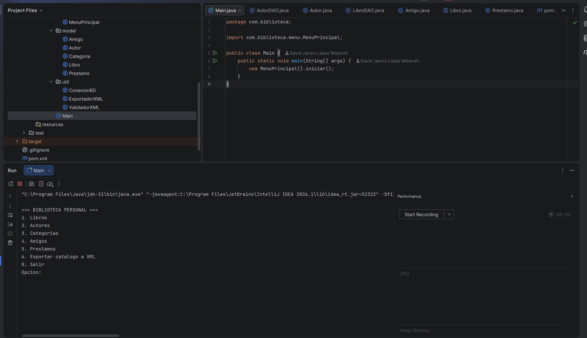
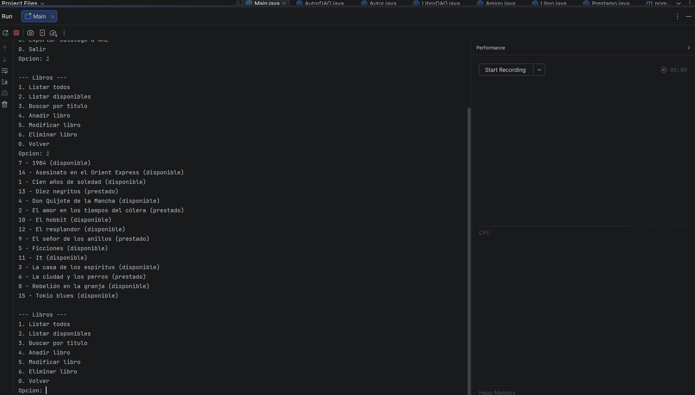
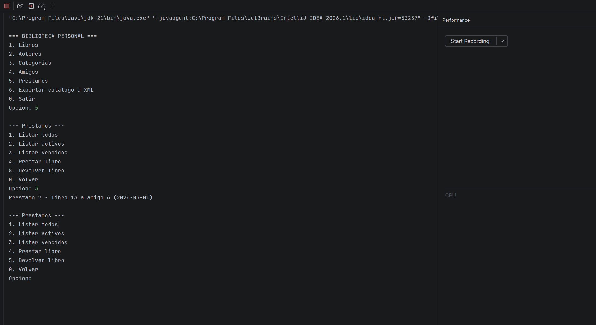
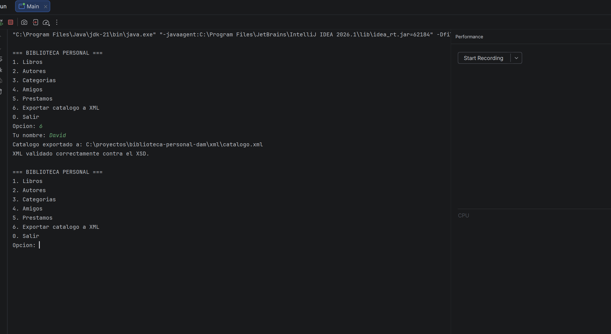
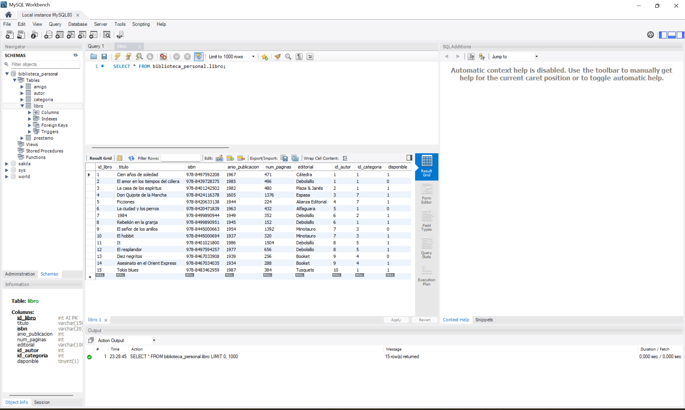
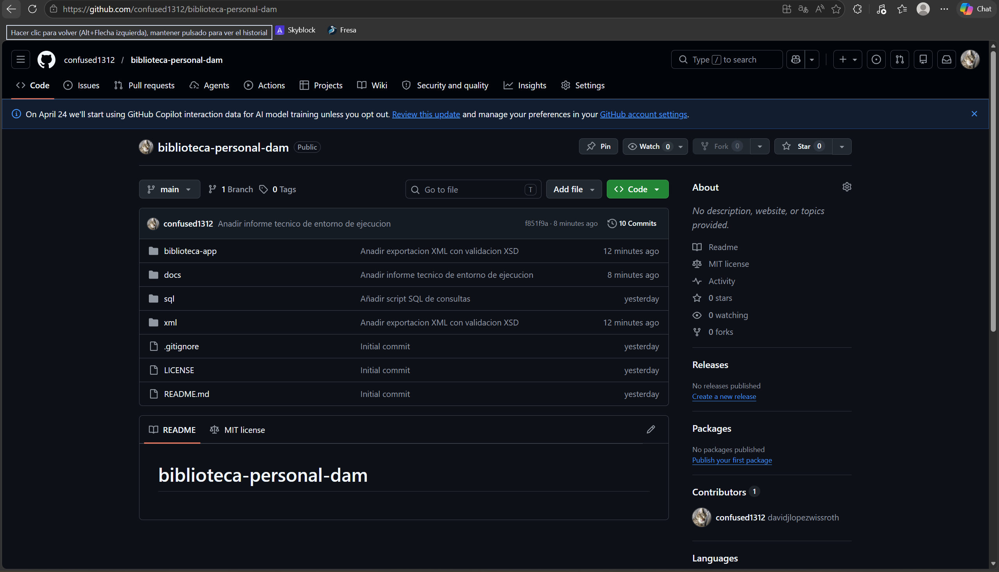

# Biblioteca Personal

Aplicacion de escritorio en Java para gestionar una coleccion personal de libros, los prestamos a amigos y la informacion asociada (autores, categorias, devoluciones). Los datos se almacenan en una base de datos MySQL y se acceden mediante JDBC.

Proyecto Intermodular del Ciclo Formativo de Grado Superior **Desarrollo de Aplicaciones Multiplataforma (DAM)**.

---

## Indice

1. [Caracteristicas](#caracteristicas)
2. [Capturas](#capturas)
3. [Modulos cubiertos](#modulos-cubiertos)
4. [Arquitectura del proyecto](#arquitectura-del-proyecto)
5. [Aportacion al MPO](#aportacion-al-mpo-de-ampliacion-de-programacion)
6. [Estructura del repositorio](#estructura-del-repositorio)
7. [Modelo de datos](#modelo-de-datos)
8. [Requisitos](#requisitos)
9. [Instalacion](#instalacion)
10. [Uso](#uso)
11. [Tecnologias](#tecnologias)
12. [Autor](#autor)
13. [Licencia](#licencia)

---

## Caracteristicas

- Gestion CRUD completa de libros, autores, categorias y amigos.
- Registro de prestamos con fecha prevista de devolucion y deteccion automatica de prestamos vencidos.
- Control de disponibilidad: cuando un libro se presta queda marcado como no disponible hasta que se registra la devolucion.
- Busqueda de libros por titulo (filtros con LIKE).
- Exportacion del catalogo completo a formato XML con validacion automatica contra esquema XSD.
- Validacion reactiva de entradas del usuario (email, ISBN, anio, telefono, fechas).
- Estructura por capas (modelo / DAO / servicios / utilidades / menu) que separa responsabilidades.
- Manejo robusto de codificacion UTF-8 para tildes y caracteres especiales.

---

## Capturas

### Aplicacion en consola

Menu principal de la aplicacion con todas las opciones disponibles:

Listado de los 15 libros del catalogo, con su estado de disponibilidad:

Listado de prestamos vencidos:

Exportacion del catalogo a XML y validacion contra el esquema XSD:

### Base de datos

Tabla libro en MySQL Workbench con los 15 registros de ejemplo:

### Repositorio

Vista del repositorio en GitHub:

---

## Modulos cubiertos

Este proyecto integra los seis modulos del primer curso de DAM:

| Codigo | Modulo                       | Aportacion del proyecto                                                                                       |
|--------|------------------------------|---------------------------------------------------------------------------------------------------------------|
| 0484   | Bases de Datos               | Diseno E/R, modelo relacional, scripts SQL de creacion, insercion y consultas (15 consultas representativas). |
| 0487   | Entornos de Desarrollo       | Uso de IntelliJ IDEA, Maven, Git y GitHub con commits significativos a lo largo del desarrollo.               |
| 0373   | Lenguajes de Marcas          | Exportacion del catalogo a XML, esquema XSD con tipos personalizados y validacion automatica.                 |
| 0485   | Programacion                 | Aplicacion Java orientada a objetos con conexion JDBC, manejo de excepciones y CRUD completo.                 |
| 0483   | Sistemas Informaticos        | Informe tecnico de entorno de ejecucion, instalacion paso a paso y mantenimiento.                             |
| MPO    | Ampliacion de Programacion   | Estructura por capas, capa de servicios con reglas de negocio, validacion de entradas y patron Resultado.     |

---

## Arquitectura del proyecto

El codigo Java esta organizado en cinco capas con responsabilidades separadas:

| Capa             | Paquete                  | Responsabilidad                                                                          |
|------------------|--------------------------|------------------------------------------------------------------------------------------|
| Presentacion     | com.biblioteca.menu      | Interfaz por consola: lectura de entradas y formato de salida.                           |
| Servicios        | com.biblioteca.service   | Reglas de negocio (ej: no se puede prestar un libro no disponible, ni con fecha pasada). |
| Acceso a datos   | com.biblioteca.dao       | Operaciones CRUD contra MySQL via JDBC.                                                  |
| Modelo           | com.biblioteca.model     | Clases POJO que representan las entidades del dominio.                                   |
| Utilidades       | com.biblioteca.util      | Conexion BBDD, validaciones, exportacion/validacion XML, patron Resultado.               |

Esta separacion permite modificar cualquier capa sin afectar al resto. Por ejemplo, sustituir el menu por consola por una interfaz grafica solo requeriria reescribir la capa de presentacion.

---

## Aportacion al MPO de Ampliacion de Programacion

El modulo MPO requiere una mejora estructural respecto al proyecto base. Las mejoras introducidas en este proyecto son:

### 1. Capa de servicios (service/)

La logica de negocio (validar disponibilidad de libros, comprobar fechas de prestamo, gestionar devoluciones) se ha extraido del menu y se ha encapsulado en la clase PrestamoService. El menu solo se encarga de leer datos del usuario y mostrar resultados; las reglas de negocio viven en el servicio.

### 2. Patron Resultado (util/ResultadoOperacion)

En lugar de devolver boolean desde los servicios, se usa una clase ResultadoOperacion que encapsula tanto el exito/fallo como un mensaje descriptivo. Esto evita repetir mensajes de error en distintos puntos del codigo y facilita la trazabilidad. El menu simplemente lee el resultado del servicio e imprime el mensaje, sin necesidad de saber por que ha fallado la operacion.

### 3. Validacion reactiva de entradas (util/Validador)

La clase Validador centraliza las validaciones de formato (email, ISBN, anio, telefono, etc.). El menu reintenta la lectura hasta que el usuario introduce un dato valido, mostrando un mensaje claro en cada intento. Esto mejora la robustez de la aplicacion frente a entradas erroneas.

### 4. Validacion XML como mejora estructural

La exportacion del catalogo a XML con validacion automatica contra un esquema XSD es una mejora estructural significativa: la aplicacion no se limita a guardar datos en la base de datos, sino que tambien los expone en un formato estandar e interoperable.

---

## Estructura del repositorio

    biblioteca-personal-dam/
    +-- biblioteca-app/              -> Aplicacion Java (proyecto Maven)
    |   +-- src/main/java/com/biblioteca/
    |   |   +-- model/               -> Clases POJO
    |   |   +-- dao/                 -> Capa de acceso a datos
    |   |   +-- service/             -> Capa de servicios (reglas de negocio)
    |   |   +-- util/                -> Utilidades (conexion, validador, XML)
    |   |   +-- menu/                -> MenuPrincipal (interfaz por consola)
    |   |   +-- Main.java            -> Punto de entrada
    |   +-- pom.xml                  -> Dependencias Maven
    +-- sql/                         -> Scripts de BBDD
    +-- xml/                         -> Esquema XSD, ejemplos XML y XML invalido de prueba
    +-- docs/
    |   +-- bbdd/                    -> Diagrama E/R y modelo relacional
    |   +-- sistemas/                -> Informe tecnico de Sistemas Informaticos
    |   +-- capturas/                -> Capturas de evidencia
    +-- README.md
    +-- LICENSE
    +-- .gitignore

---

## Modelo de datos

La base de datos biblioteca_personal esta formada por cinco tablas:

- **autor**: catalogo de autores con nacionalidad y anio de nacimiento.
- **categoria**: generos literarios.
- **libro**: titulos, ISBN, editorial, anio de publicacion y disponibilidad. Tiene relaciones con autor y categoria.
- **amigo**: contactos a los que se prestan libros.
- **prestamo**: tabla intermedia que relaciona libros con amigos, registrando fechas previstas y reales de devolucion.

El diagrama entidad/relacion completo se encuentra en docs/bbdd/diagrama_er_biblioteca.pdf y el modelo relacional en docs/bbdd/modelo_relacional.md.

---

## Requisitos

- Java JDK 21 o superior (probado con Eclipse Temurin 21.0.8 LTS).
- MySQL Server 8.0 o superior.
- Maven (integrado en IntelliJ IDEA o instalado como standalone).
- Git (opcional, para clonar el repositorio).

Sistemas operativos compatibles: Windows 10/11, Linux moderno y macOS 11+.

Para detalles completos consultar el informe tecnico en docs/sistemas/informe_tecnico.md.

---

## Instalacion

### 1. Clonar el repositorio

    git clone https://github.com/confused1312/biblioteca-personal-dam.git
    cd biblioteca-personal-dam

### 2. Crear la base de datos

Importante: en Windows el cliente mysql debe ejecutarse con el flag `--default-character-set=utf8mb4` para evitar problemas con tildes y enes.

    mysql --default-character-set=utf8mb4 -u root -p

Dentro del cliente:

    SOURCE sql/01_crear_tablas.sql;
    SOURCE sql/02_insertar_datos.sql;

### 3. Configurar la conexion

Si la contrasena de root no es root1234, editar el archivo `biblioteca-app/src/main/java/com/biblioteca/util/ConexionBD.java` y modificar la constante PASSWORD.

### 4. Ejecutar

Abrir la carpeta biblioteca-app en IntelliJ IDEA, esperar a que Maven descargue las dependencias y ejecutar Main.java.

---

## Uso

Al arrancar, la aplicacion muestra el menu principal con seis opciones: gestion de libros, autores, categorias, amigos, prestamos y exportacion del catalogo a XML. Cada opcion da acceso a un submenu con operaciones CRUD especificas. La opcion 6 genera el archivo xml/catalogo.xml con todos los libros y lo valida automaticamente contra el esquema xml/catalogo.xsd.

---

## Tecnologias

- Java 21
- MySQL 8.0
- JDBC (driver mysql-connector-j 8.4.0)
- Maven
- javax.xml.validation (API estandar de Java para validacion XML contra XSD)
- IntelliJ IDEA
- Git + GitHub
- draw.io (diseno del diagrama entidad/relacion)

---

## Autor

**David Jamiro Lopez Wissroth**
Estudiante de 1o DAM
GitHub: [@confused1312](https://github.com/confused1312)

---

## Licencia

Este proyecto esta publicado bajo licencia MIT. Ver el archivo LICENSE para mas detalles.
